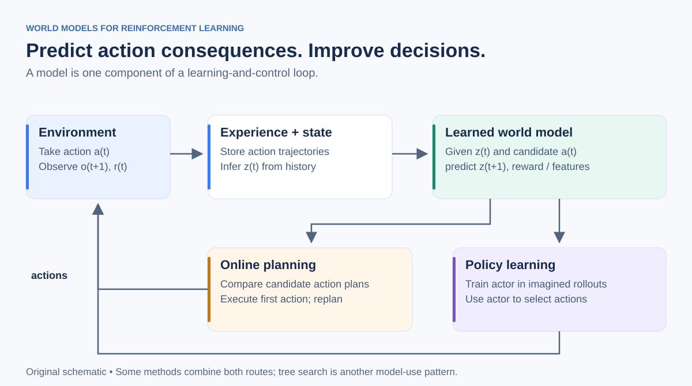

# World Models for Reinforcement Learning

**Learn action-conditioned dynamics. Predict useful futures. Turn predictions into better decisions.**

A curated learning repository for readers who already know reinforcement learning and want to understand world models through **model-based RL, latent dynamics, planning, and imagination-based policy learning**.

## Start here

1. [Build the mental model](docs/01-mental-model.md): definitions, examples, and the prediction–decision distinction.
2. [Work through the mathematics](docs/02-key-equations.md): latent dynamics, model learning, MPC, imagination, and value equivalence.
3. [Compare the approaches](docs/03-method-map.md): PlaNet, Dreamer, TD-MPC, JEPA-style planning, and MuZero.
4. [Follow the reading path](READING_PATH.md): a focused sequence with questions to answer.
5. [Browse recent research](papers/04-frontier/README.md), [surveys](surveys/README.md), and [tutorials and talks](tutorials/README.md).
6. [Track your reading](TRACKER.md) and write notes with the [paper-note template](notes/TEMPLATE.md).

## Scope

The working object is an action-conditioned transition model:

$$
\hat p_\theta(s_{t+1},r_t\mid s_t,a_t)
\quad\text{or}\quad
\hat p_\theta(z_{t+1},r_t\mid z_t,a_t).
$$

Its predictions support planning, policy evaluation, or policy improvement. The latent state can summarize observation history; it need not correspond to a human-interpretable physical state.

Visual inputs are in scope when they support control. Photorealistic video generation, 3D reconstruction, and scene rendering are peripheral unless a work demonstrates a meaningful prediction–action loop. JEPA-style model-based control belongs here even when its training uses reward-free offline trajectories rather than online RL.

**A world model is a component; model-based RL is a learning-and-decision procedure.** “World-action model” is used differently across papers: always inspect what is predicted and how an action is selected.

## Repository map

| Folder | Purpose |
|---|---|
| [docs/](docs/README.md) | Explanations, formulas, design tradeoffs |
| [papers/01-foundations/](papers/01-foundations/README.md) | Dynamics learning, model bias, latent state estimation |
| [papers/02-imagination-and-planning/](papers/02-imagination-and-planning/README.md) | Dreamer, TD-MPC, MuZero, value equivalence |
| [papers/03-jepa-and-goal-planning/](papers/03-jepa-and-goal-planning/README.md) | Embedding prediction and goal-conditioned control |
| [papers/04-frontier/](papers/04-frontier/README.md) | 2025–2026 research and open questions |
| [tutorials/](tutorials/README.md) | Lectures, author blogs, and workshop recordings |
| [surveys/](surveys/README.md) | Broad maps with scope and reading guidance |
| [notes/](notes/README.md) | Your own paper notes and synthesis |
| [assets/](assets/README.md) | Original editable SVG figures and Mermaid diagrams |
| [data/](data/README.md) | Machine-readable bibliography and verification notes |

## Three questions to ask of every paper

1. **Prediction:** Given which history and candidate actions, what does the model predict?
2. **Learning:** Which losses preserve information useful for the eventual task?
3. **Decision:** Does an actor, trajectory optimizer, or tree search choose the action?

Then ask whether performance improves **in the environment**, and how much real data, training compute, and decision-time compute it costs.

## Curation and maintenance

- Initial research snapshot: **2026-09-12**. This is a curated selection, not an exhaustive or continuously verified leaderboard.
- Priorities express learning value for an RL reader, not a citation-count ranking or independent replication.
- Publication date, revision date, and verification date are different fields in [the bibliography](data/resources.json).
- Recent preprints are labeled as research leads. Reported performance claims have not been independently reproduced.
- Workshop programs are verified as programs; availability of every recording is not assumed.
- All figures in this repository are original explanatory schematics. Paper PDFs and third-party figures are linked, not redistributed.
- No monitoring job runs automatically. See [CONTRIBUTING.md](CONTRIBUTING.md) for a lightweight update process.

GitHub renders the Markdown math and Mermaid diagrams; SVG figures provide a portable visual fallback. You can read the guide, edit the tracker, and add notes directly in your browser.
