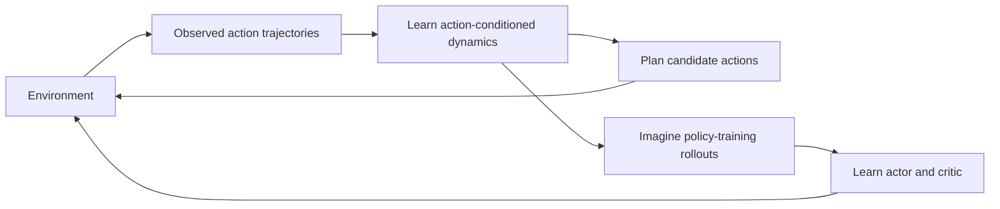
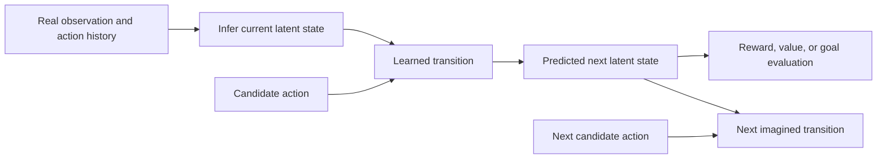
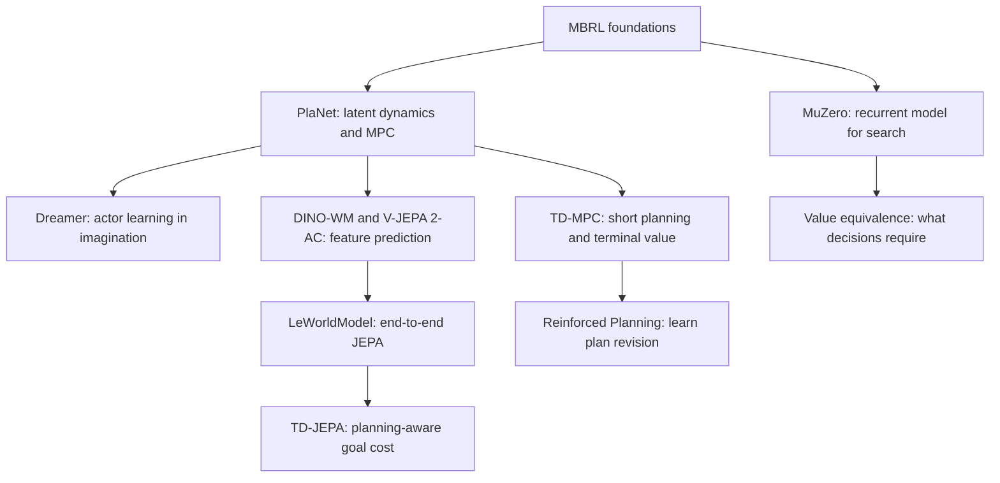

# Editable diagrams

## Learn and act

## State estimation versus imagination

## A reading route

Arrows indicate a suggested learning sequence or conceptual connection, not a complete historical lineage.

[Figure index](README.md) · [Home](../README.md)
