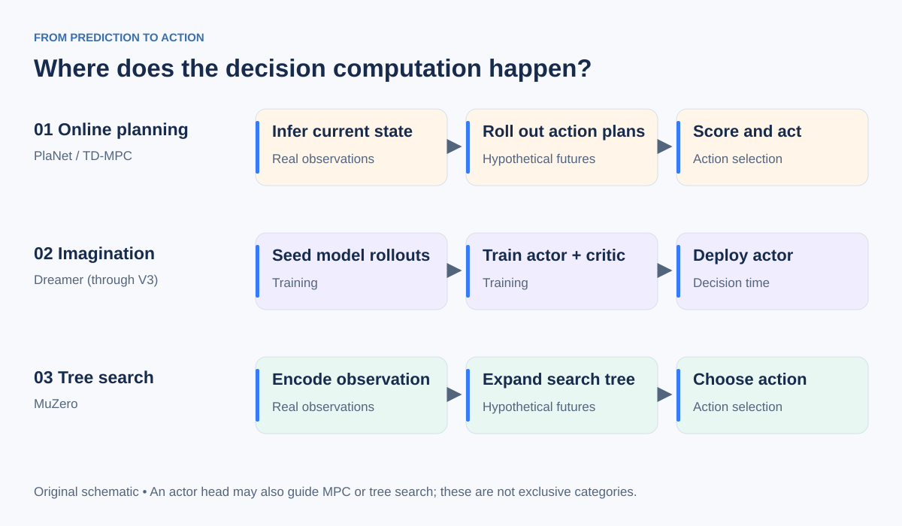

# 1. A mental model of world models

## Start with the RL object you already know

An MDP supplies a transition distribution and reward function. In model-based RL, an agent uses a model of these quantities to reason about actions without executing every candidate in the real environment. When the model is learned, interaction data serves two purposes: improving behavior and improving the model used to derive behavior.

In this repository, a **world model** is a learned predictive model of action consequences, possibly in an abstract state space. This is a working definition for control, not a universal definition for all communities using the term. [Moerland et al.](https://arxiv.org/abs/2006.16712) give a broad treatment of the model-learning and model-usage design space.

Imagine a navigation task with a door. The observation shows the agent near the door, but the recent history indicates whether it is locked. A useful state representation must preserve that information. A model can predict that moving forward succeeds after unlocking the door, while predicting no progress otherwise. A planner compares the candidate sequences. A policy can instead learn from many such imagined sequences and select the appropriate action directly.

The model need not recreate the door texture. It does need to preserve the distinctions that affect actions, reachability, and reward. This example is an explanatory thought experiment, not an experimental result.

## Separate four components

| Component | Question it answers | Typical object |
|---|---|---|
| State estimator / encoder | What information from my experience matters now? | History to latent state or belief |
| Forward dynamics | What would happen if I took this action? | State and action to next-state distribution |
| Objective / evaluator | How useful is that outcome? | Reward, cost, goal metric, value |
| Decision procedure | Which action should I take? | Actor, MPC, or tree search |

An encoder alone is not an action-conditioned world model. A dynamics predictor alone does not specify what the agent wants. A goal distance can supply a control objective without a learned reward head. A learned actor can use the model during training without invoking a planner at deployment.

## Three ways predictions become decisions

**Decision-time trajectory planning.** Infer the current state, predict consequences of candidate action sequences, score them, execute the first action of a selected plan, observe again, and replan. PlaNet and TD-MPC illustrate this family. Planning is closed-loop across real environment steps even if the inner optimizer evaluates open-loop candidate sequences. [PlaNet](https://planetrl.github.io/), [TD-MPC](https://www.nicklashansen.com/td-mpc/)

**Policy learning from imagination.** Generate model trajectories during training and use them to improve an actor and critic. The trained actor chooses actions at deployment. Dreamer follows this pattern; its recurrent model still helps estimate the current latent state, but the standard agent does not run a new trajectory search per action. [Dreamer](https://danijar.com/project/dreamer/)

**Search with decision-relevant predictions.** Unroll learned latent dynamics in a search tree and evaluate branches using predicted rewards, values, and policy priors. MuZero demonstrates that useful search does not require an observation reconstruction objective. [MuZero](https://arxiv.org/abs/1911.08265)

These categories are not mutually exclusive. TD-MPC uses a learned policy to guide planning and a value function to estimate return beyond its rollout horizon.

## Latent prediction is a design choice, not a complete algorithm

“Latent” says where prediction occurs. It does not say how the representation is trained, whether the model is stochastic, what objective the planner optimizes, or whether an actor is trained.

- PlaNet and Dreamer through V3 use reconstruction as one signal for learning their latent models.
- TD-MPC learns a reconstruction-free representation with latent consistency and task objectives.
- DINO-WM predicts pretrained features and plans toward goal features.
- V-JEPA 2-AC adds action-conditioned prediction after action-free pretraining.
- Original MuZero trains its recurrent model through reward, value, and policy targets rather than explicit next-observation embedding matching.

Read the [method map](03-method-map.md) with these distinctions in mind.

## JEPA and RL: the precise connection

JEPA is a family of approaches to predicting representations. An image JEPA or an action-free video predictor is not automatically an MDP transition model. For control, you need a predictor conditioned on actionable controls, a representation with sufficient dynamics information, and an objective plus a decision procedure.

[V-JEPA 2](https://arxiv.org/abs/2506.09985) distinguishes action-free pretraining from V-JEPA 2-AC post-training. [DINO-WM](https://dino-wm.github.io/) learns from offline action trajectories and performs goal-directed planning. These are closely related to learned-model control even without conventional online reward maximization. Avoid assuming that all self-supervised world-model training is itself RL.

## Forward prediction, inverse dynamics, and policies

- A **forward model** predicts the outcome of an action: `(state, action) → next state`.
- An **inverse dynamics model** infers an action compatible with a transition: `(state, next state) → action distribution`.
- A **goal-conditioned policy** selects an action to pursue a goal: `(state, goal) → action distribution`.

Inverse dynamics does not by itself solve long-horizon planning: the requested next state might be unreachable, multiple actions may fit the transition, and a local inverse model does not decide which intermediate states are valuable.

**Checkpoint:** Explain how one learned transition model could support both MPC and actor training. Then explain why accurate one-step predictions do not guarantee either will work well.

[Next: key equations](02-key-equations.md) · [Home](../README.md)
