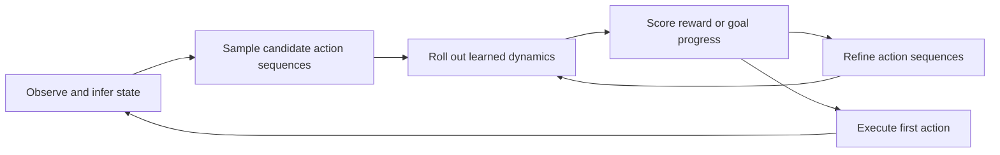

# 2. Key equations

These are schematic equations for comparing methods, not verbatim implementations. Termination, discount conventions, target networks, and gradient estimators vary by paper.

## Notation

| Symbol | Meaning |
|---|---|
| $s_t$ | Environment state, possibly unobserved |
| $o_t$ | Observation |
| $a_t$ | Action applied at time $t$ |
| $r_t$ | Reward resulting from that action |
| $h_t=(o_{\le t},a_{<t})$ | Available history |
| $z_t$ | Learned representation / internal state |
| $H$ | Imagination or planning horizon |
| $\gamma$ | Discount factor |

## 1. State-space dynamics

$$
(s_{t+1},r_t)\sim\hat p_\theta(\cdot\mid s_t,a_t),
\qquad
\mathcal L_{\mathrm{model}}=-\mathbb E_{\mathcal D}\log\hat p_\theta(s_{t+1},r_t\mid s_t,a_t).
$$

This maximum-likelihood objective estimates transition and reward distributions on the data distribution. It does not guarantee accuracy on the action sequences a future planner will choose. Model ensembles can help estimate epistemic uncertainty, but are not automatically calibrated outside data coverage. [MBPO](https://bair.berkeley.edu/blog/2019/12/12/mbpo/)

## 2. State estimation versus imagination

$$
z_t\sim q_\theta(\cdot\mid h_t),
\qquad
\hat z_{t+1}\sim p_\theta(\cdot\mid z_t,a_t).
$$

The state estimator uses observations. A model rollout predicts future latent states without seeing future observations. In a POMDP the ideal belief is $b_t(s)=P(s_t=s\mid h_t)$; a learned latent state approximates task-relevant history but is not guaranteed to be a sufficient belief state.

PlaNet's RSSM combines deterministic recurrent memory and stochastic latent state. Writing both as $z_t$ is convenient here but hides that structure. [PlaNet](https://proceedings.mlr.press/v97/hafner19a/hafner19a.pdf)

## 3. Reconstructive latent-model learning

$$
\mathcal L_{\mathrm{latent}}=\sum_t\left\{
\mathbb E_q\left[-\log p_\theta(o_t\mid z_t)-\log p_\theta(r_t\mid z_t,a_t)\right]
+\beta\,\mathbb E_q D_{\mathrm{KL}}\left(q_\theta(z_t\mid h_t)\,\Vert\,p_\theta(z_t\mid z_{t-1},a_{t-1})\right)
\right\}.
$$

The KL term is understood per time step with expectation over preceding latent states. This is a schematic variational objective; actual RSSM implementations factor deterministic and stochastic states and may use continuation heads, KL balancing, and free bits.

Reconstruction helps retain predictive information. It can also allocate capacity to details irrelevant to control. Removing reconstruction introduces a different challenge: preventing representation collapse and preserving task-relevant state. [Dreamer](https://arxiv.org/abs/1912.01603)

## 4. Embedding prediction

$$
\mathcal L_{\mathrm{pred}}=\mathbb E_{\mathcal D}\sum_{k=1}^{H}
d\!\left(\hat z_{t+k},e_{\bar\theta}(o_{t+k})\right),
\qquad
\hat z_{t+k+1}=f_\theta(\hat z_{t+k},a_{t+k}).
$$

This schematic uses a single-frame encoder; a history encoder can replace it. The target encoder may be frozen, updated with an exponential moving average, or trained jointly with regularization. **These choices are method-specific.** A constant encoder could minimize a naive prediction loss while representing nothing useful.

DINO-WM uses pretrained features; V-JEPA 2-AC uses a pretrained representation with action-conditioned post-training. LeWorldModel studies end-to-end training with next-embedding prediction and a distribution regularizer. [DINO-WM](https://arxiv.org/abs/2411.04983), [V-JEPA 2](https://arxiv.org/abs/2506.09985), [LeWorldModel](https://arxiv.org/abs/2603.19312)

## 5. Model-predictive control

$$
\mathbf a^*=\arg\max_{a_t,\ldots,a_{t+H-1}}
\mathbb E_{\hat p_\theta}\left[
\sum_{k=0}^{H-1}\gamma^k\hat r(\hat z_{t+k},a_{t+k})
+\gamma^H\hat V(\hat z_{t+H})\right].
$$

Execute only $a_t^*$, observe $o_{t+1}$, update the internal state, and optimize again. The terminal value estimates return after the explicit rollout. Methods differ in optimizer, uncertainty treatment, policy proposals, and whether they use $V$ or a terminal $Q$ estimate. [TD-MPC](https://www.nicklashansen.com/td-mpc/)

## 6. Goal-directed planning without a learned reward

$$
\mathbf a^*=\arg\min_{\mathbf a}
\mathbb E\left[d(\hat z_{t+H},z_g)
+\lambda\sum_{k=0}^{H-1}c(a_{t+k})\right],
\qquad z_g=e(o_g).
$$

The action cost is optional. A goal image defines $z_g$. The essential assumption is that the chosen distance meaningfully ranks reachable progress. Euclidean closeness can be misleading around obstacles, under aliasing, or when controllable factors are overwhelmed by nuisance features. [DINO-WM](https://dino-wm.github.io/), [Temporal-Distance JEPA](https://arxiv.org/abs/2607.25337)

## 7. Learning an actor in imagination

$$
J(\phi)=\mathbb E_{\substack{\hat z_{k+1}\sim\hat p_\theta(\cdot\mid\hat z_k,a_k)\\a_k\sim\pi_\phi(\cdot\mid\hat z_k)}}
\left[\sum_{k=0}^{H-1}\gamma^k\hat r_k+\gamma^H V_\psi(\hat z_H)\right].
$$

Model states seed imagined trajectories; actor and critic parameters improve using their predicted rewards and returns. Dreamer versions differ in latent distributions, return targets, and gradient estimators. The original Dreamer emphasizes analytic gradients through latent dynamics. Training an actor this way is often called amortizing decision computation: the actor reuses learned behavior across decisions. [Dreamer](https://arxiv.org/abs/1912.01603)

## 8. Value equivalence

$$
(\mathcal T_m^\pi V)(s)=r_m^\pi(s)+\gamma\mathbb E_{s'\sim p_m^\pi(\cdot\mid s)}V(s').
$$

$$
m\sim_{\Pi,\mathcal V}\tilde m
\iff
\mathcal T_m^\pi V=\mathcal T_{\tilde m}^\pi V
\quad\forall\pi\in\Pi,\ V\in\mathcal V.
$$

Equivalence is relative to policy and value-function classes. Two models can differ as transition predictors yet agree on the relevant Bellman updates. This motivates decision-aware abstraction; it does not mean arbitrary inaccurate dynamics will plan correctly. The relationship to MuZero involves further distinctions such as proper value equivalence. [Value Equivalence Principle](https://arxiv.org/abs/2011.03506)

[Next: method map](03-method-map.md) · [Home](../README.md)
