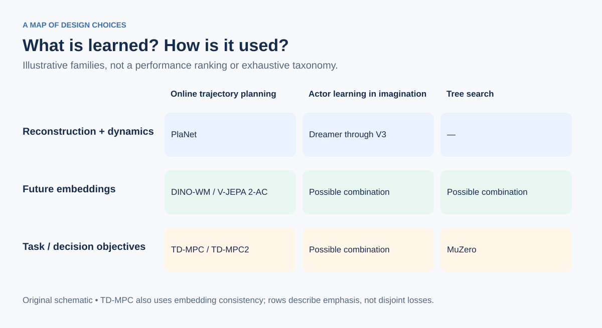

# 3. Compare methods along independent axes

| Method | Representation / model training | Model usage | Read for |
|---|---|---|---|
| [MBPO](https://arxiv.org/abs/1906.08253) | Probabilistic dynamics ensemble, typically observed state space | Short synthetic rollouts augment off-policy learning | Distribution shift and model bias |
| [PlaNet](https://planetrl.github.io/) | RSSM with observation and reward prediction | MPC in latent space | State inference versus imagined rollout |
| [Dreamer through V3](https://doi.org/10.1038/s41586-025-08744-2) | Reconstructive latent model; implementation evolves by version | Actor–critic learning in imagination | Learning behavior inside a model |
| [TD-MPC / TD-MPC2](https://www.tdmpc2.com/) | Reconstruction-free latent consistency, reward and value learning | Short-horizon MPC, policy guidance, terminal value | Combining model-based and model-free estimates |
| [DINO-WM](https://dino-wm.github.io/) | Offline action-conditioned prediction of pretrained features | Goal-directed action-sequence optimization | Task objectives supplied after model learning |
| [V-JEPA 2-AC](https://arxiv.org/abs/2506.09985) | Action-conditioned post-training after representation pretraining | MPC toward visual goals | Connecting self-supervision to control |
| [LeWorldModel](https://arxiv.org/abs/2603.19312) | End-to-end next-embedding prediction plus anti-collapse regularization | Latent goal planning | Simpler joint representation/dynamics learning |
| [MuZero](https://arxiv.org/abs/1911.08265) | Recurrent latent model trained on reward/value/policy targets | MCTS | Decision-relevant abstraction |

This is a conceptual table, not a performance ranking. Benchmarks, action spaces, data budgets, and compute costs differ substantially.

## Distinctions worth keeping

- **Decoder-free is not synonymous with JEPA.** TD-MPC and MuZero also avoid observation reconstruction but use different training targets and decision procedures.
- **A policy head does not imply actor-only inference.** TD-MPC uses one to guide planning; MuZero uses policy priors in search.
- **Pretraining does not imply universal transfer.** A goal may be new while the underlying dynamics, embodiment, and action semantics remain familiar.
- **Action conditioning is not a causal guarantee.** Predicting logged action outcomes can fail under confounding, distribution shift, or unsupported interventions.
- **A visual decoder can be diagnostic.** A paper showing decoded imagined frames does not imply that pixel prediction drives its controller.
- **Latent state can need memory.** A single frame may omit velocity, occluded objects, or hidden task variables.

## A compact way to annotate a new paper

Write one line with five fields:

`data → state representation → prediction objective → decision procedure → evaluation`

Example: `offline action trajectories → frozen visual features → future feature prediction → goal MPC → environment goal success` describes the central DINO-WM pattern.

[Next: open questions](04-open-questions.md) · [Home](../README.md)
